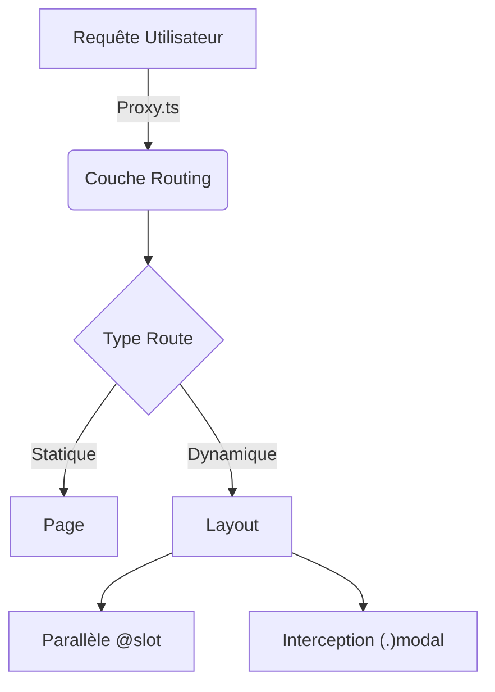
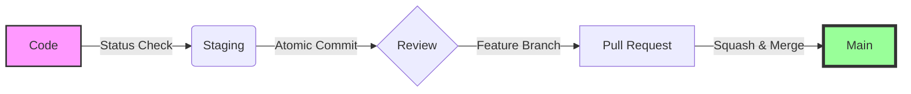

# ⚡️ Registre de Skills Yanix
> *Orchestrez vos workflows IA avec précision, élégance et typage strict.*

[](https://opensource.org/licenses/MIT)

---

## 🚀 Démarrage Rapide

Injectez des compétences hautement spécialisées directement dans votre environnement **Cursor** ou **Windsurf** via `bunx` ou `pnpx`.

> [!TIP]
> Pas besoin de cloner le repo. Lancez simplement la commande à la racine de votre projet.

```bash
# Avec Bun (Recommandé)
bunx skills add https://github.com/yanix2445/skills --skill url-orchestrator

# Avec pnpm
pnpx skills add https://github.com/yanix2445/skills --skill url-orchestrator
```

### 📋 Lister les skills disponibles

Curieux de voir ce qui est disponible ? Affichez le contenu du registre instantanément :

```bash
bunx skills add yanix2445/skills --list
```

---

## 📦 Catalogue de Skills

| Nom du Skill | Type | Impact | Description |
| :--- | :---: | :---: | :--- |
| **[`url-orchestrator`](url-orchestrator/SKILL.md)** | 🌐 | `HIGH` | Maîtrisez votre routing. Aligné **Next.js 16** (Proxy, Parallel Routes), strictement typé (`Route`), et SEO-ready. |
| **[`git-convention`](git-convention/SKILL.md)** | 🛡️ | `CRIT` | La ceinture de sécurité de votre repo. Protection contre les force-push, commits atomiques et conventions strictes. |
| *Bientôt disponible* | 🔜 | - | *Restez à l'affût pour les skills Auth, Paiement et UI.* |

---

## ✨ Détails des Fonctionnalités

### 🌐 URL Orchestrator
> *Le guide définitif pour la gouvernance Next.js App Router.*

- [x] **Conforme Next.js 16**: `proxy.ts` natif, `searchParams` (Async), et Typed Routes.
- [x] **Bibliothèque de Patterns**: Exemples prêts à l'emploi pour Intercepting Routes (`(.)folder`), Parallel Routes (`@folder`), et plus.
- [x] **Gouvernance Stricte**: Règles pour standardiser les slugs, les canonicals et la structure des fichiers.
- [ ] ~~Support Middleware Legacy~~ (Déprécié)

<details>
<summary><strong>🔍 Jeter un œil à l'architecture</strong></summary>


</details>

### 🛡️ Git Convention
> *Plus qu'un linter, un gardien pour votre historique Git.*

- [x] **Sécurité Critique**: Bloque les force-push sur `main` et impose la vérification avant `add`.
- [x] **Workflow Atomique**: Une feature = une branche. Un changement = un commit.
- [x] **Recovery Tactics**: Apprenez à réparer (`--amend`, `restore`) sans détruire.
- [x] **Standards**: Conventional Commits en Français obligatoires.

<details>
<summary><strong>🔍 Jeter un œil à l'architecture</strong></summary>


</details>

---

## 🛠 Utilisation & Workflow

1. **Installez** le skill.
2. **Lisez** le `SKILL.md` pour comprendre la gouvernance.
3. **Appliquez** les patterns depuis le dossier `references/`.

> [!IMPORTANT]
> Vérifiez toujours les mises à jour. Le web évolue vite, et ces skills aussi.

---

<p align="center">
  <sub>Réalisé avec ❤️ par Yanis • Propulsé par <a href="https://github.github.com/gfm/">GFM</a></sub>
</p>
